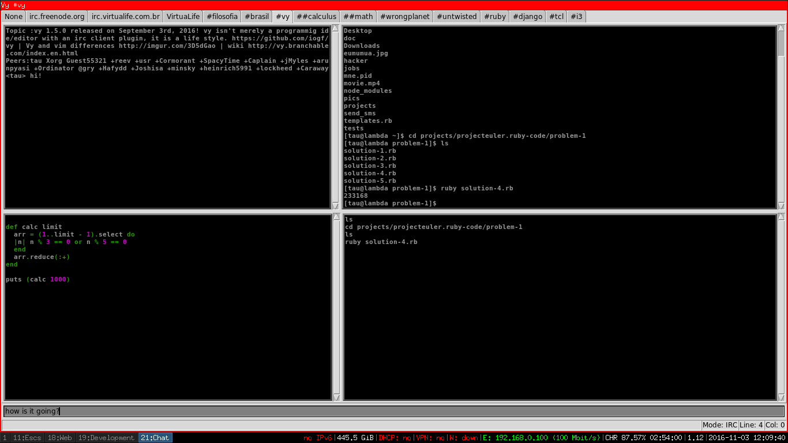

# vyirc

An irc plugin for vy.

After some years using vy i just noticed that it was lacking an irc client plugin like emacs/vim.
The strongest rationale behind consists of showing the power and flexibility of vy and untwisted.

I think i have been succesful in that since vyirc is a quite functional irc client(which even has a plugin)
and it is about 300 lines of code.

The below screenshot shows vyirc in action, you can code and still talk on irc :P

# Install

Install requirements with.

~~~
pip install -r requirements.txt
~~~

Then install vyirc:

~~~
pip install vyirc
~~~

Once these packages are installed just place the code in your ~/.vy/vyirc file, you can place it in
your extra command plugins section:

~~~python
##############################################################################

# The vy irc mode.
from vyirc import IrcMode

# Uncomment these lines to set up your custom color scheme.
# It accepts all available config options for Tkinter Text widget.
# IrcMode.TAGCONF = {'(VYIRC-PRIVMSG)': {'foreground': '#688B96'},
# '(VYIRC-JOIN)': {'foreground': '#F06EF0'},
# '(VYIRC-PART)': {'foreground': '#F0BDAD'},
# '(VYIRC-QUIT)': {'foreground': '#4EDB1F'},
# '(VYIRC-NICK)': {'foreground': '#E9F0AD'},
# '(VYIRC-KICK)': {'foreground': '#FC8D9A'},
# '(VYIRC-353)': {'foreground': '#BF9163'},
# '(VYIRC-332)': {'foreground': '#81BFFC'},
# '(VYIRC-CLOSE)': {'foreground': '#A7F2E9'}}

# Here, the network connections can be defined. 
def irc_freenode(addr='irc.freenode.org', port=6667, user='vy vy vy :vyirc', nick='vyirc', 
             irccmd='PRIVMSG nickserv :identify nick_password', channels=['#vy']):
    IrcMode(addr, port, user, nick, irccmd, channels)

~~~

**Note:** The vyirc plugin allows you to develop plugins for it. You can even implement irc bots on top of it.
As an example of vyirc plugin see: https://github.com/vyapp/whocall
But it would be necessary to know the workings of untwisted in order to come up with something functional.

# Usage

The vyirc plugin allows you to connect to as many irc networks as you wish however you need to first
define these irc networks in your vyirc file. 

The code snippet below shows an example of handle that is meant to be executed from vy in order
to instantiate an irc connection to irc.freenode.org. The attributes of the function should be
known to those who are used to irc networks. 

~~~~
# Here, the network connections can be defined. 
def irc_freenode(addr='irc.freenode.org', port=6667, user='vy vy vy :vyirc', nick='vyirc', 
             irccmd='PRIVMSG nickserv :identify nick_password', channels=['#vy']):
    IrcMode(addr, port, user, nick, irccmd, channels)

~~~~

In vyirc, everything is handled in tabs. Whenever you join a new channel it opens a new tab if you connect
to a new network it will open a new tab for the irc network connection as well. 

### Connect to an irc network

In order to connect to an irc network, switch to NORMAL mode then press:

    <Key-semicolon>

Then execute the function that maps to your desired irc network. Supposing you want to connect
to irc.freenode.org which was shown in the install section:

~~~python
irc_freenode()
~~~

After pressing enter it would execute the function and open a new tab where you can see freenode's server connection.
If there is someone using your nick, it will be needed to send the command below to the IRC server:

~~~
NICK new_nick
~~~

For such, switch to the IRC connection tab then press:

    <Control-e> 

In IRC mode.

### Switch to IRC mode

After having executed the irc network handle it should instantiate the class IrcMode. 
The IrcMode class is responsible by implementing the functionalities of the plugin. 

Whenever you join a new channel or instantiate a new connection it opens a new tab
and its mode is IRC. You'll eventually switch to other modes, in order to put the AreaVi
instance back to IRC mode just switch to EXTRA mode then press:

    <Key-i>

### Send IRC commands

Vy implements a keycommand to send raw irc commands to the irc server. It shows an inputbox where to type irc commands.
Switch to an irc connection tab or an irc channel tab then press:

    <Control-e> 

In IRC mode. 

### Identify nick

In order to identify nick once having opened an irc connection, just switch to IRC mode by pressing:

    <Control-e>

Then type:

~~~
PRIVMSG nickserv :IDENTIFY nick_password
~~~

Some irc networks uses the command below:

~~~
NickServ identify nick_password
~~~

### Join a channel

Press:

    <Control-e> 

In IRC mode then type:

~~~
JOIN #channel
~~~

### Part from a channel

Just switch to IRC mode, press:

    <Control-e>

Then type:

~~~
PART #channel
~~~

### Change nick

In IRC mode, press:

    <Control-e>

Then type:

~~~
NICK new_nick
~~~

### Query an user

Switch to one of the IRC network tabs then press:

    <Control-c> 

in IRC mode to type the nick of the user. 
It will create a new tab whose title is the user's nick.

### Send messages to channels and users

In IRC mode, press:

    <Key-i>

It will show up an input box field where to insert messages to send to users or channels.
Insert the message then press:

    <Return>

In order to give back focus to the AreaVi instance just press:

    <Escape>

